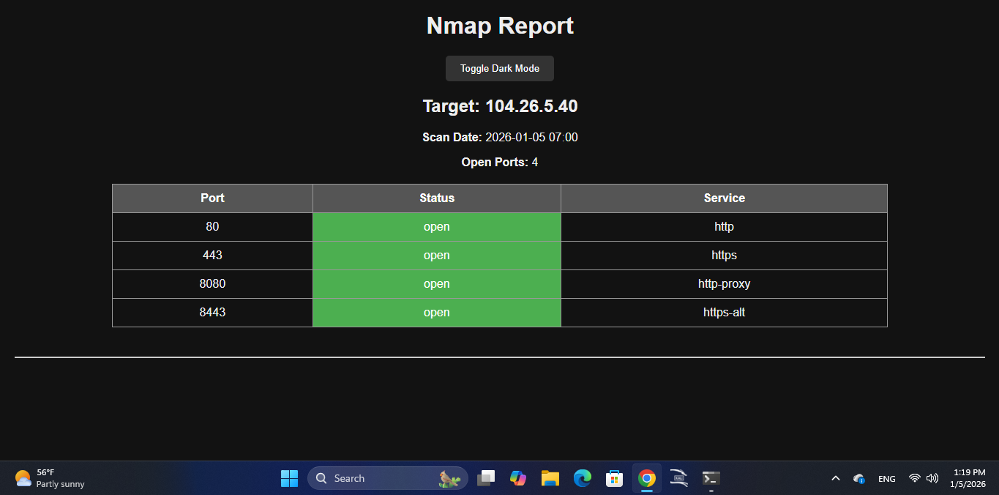
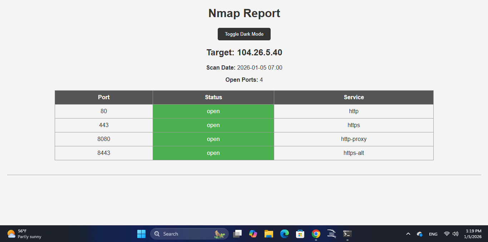

## 👤 Author

- **Name:** Kobock  
- **Country:** Algeria  
- **GitHub:** https://github.com/Kobock-sec  

This tool was created for educational and ethical security testing purposes.


# Nmap HTML Reporter

A simple Python tool to convert Nmap XML scans into beautiful HTML reports.

## 🖼️ Screenshots

### Example 1


### Example 2



---

## Features

- Supports **multiple hosts**.
- Shows **only open ports** with `--open-only` option.
- Displays **scan date** and **number of open ports**.
- Color-coded tables for **open**, **closed**, and **filtered** ports.
- **Dark mode** toggle for easy reading.
- Easy to use with **CLI arguments**.

---

## 📦 Requirements

- Python 3
- Nmap

---

## Installation

1. Clone the repository:
```bash
git clone https://github.com/kobock-sec/nmap-html-report.git
cd nmap-html-report

## 🚀 Usage

### 1️⃣ Run Nmap scan
```bash
nmap scanme.nmap.org -oX scan.xml

### 2️⃣ Generate HTML report

python3 parser.py -i scan.xml -o report.html --open-only

### 3️⃣ Open the report

explorer.exe report.html

.......................
## ⚠️ Legal Disclaimer

This tool is intended for **educational purposes only**.

Do NOT scan any system, network, or website without **explicit permission**.
The author is not responsible for any misuse of this tool.
